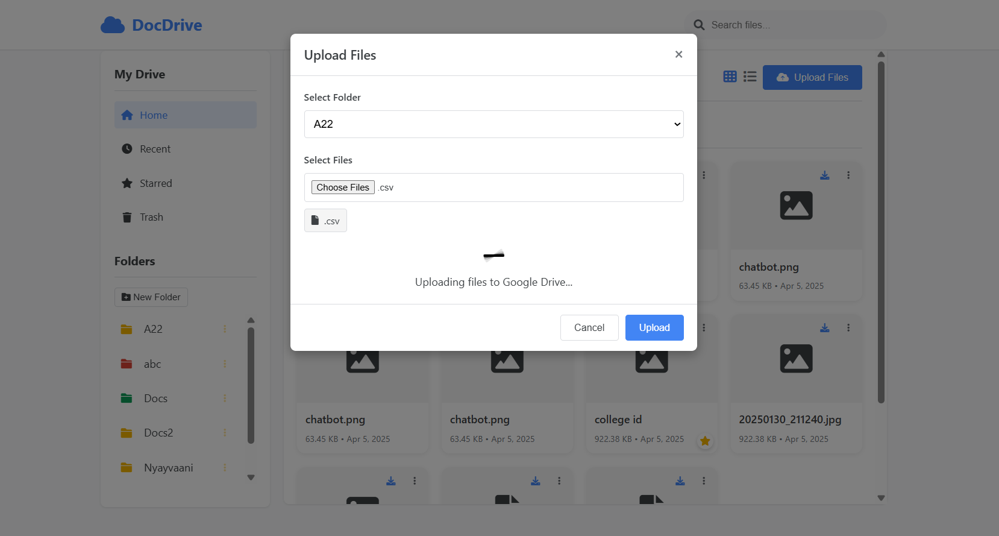
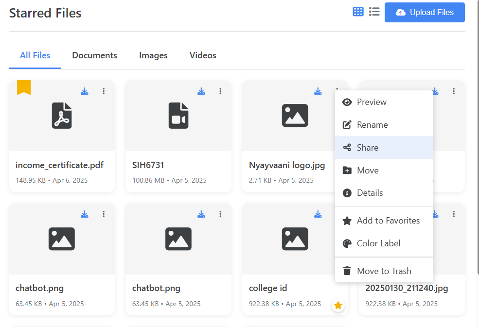

# DocDrive - Google Drive Document Manager

A powerful web application for managing files on Google Drive with an intuitive interface. Upload, organize, share, and manage your Google Drive files effortlessly through a modern web interface.


## 📸 Project Screenshots

<div align="center">

### 🖼️ Application Interface

<!-- Image Slider - Your actual DocDrive screenshots -->
<details>
<summary>🏠 <b>Main Dashboard</b> - Click to view</summary>


*Clean and intuitive main interface showing file grid view with folders, search functionality, and organized file display*

</details>

<details>
<summary>�️ <b>File Preview</b> - Click to view</summary>


*Full-screen file preview modal allowing users to view images and documents directly in the browser*

</details>

<details>
<summary>📤 <b>Upload Interface</b> - Click to view</summary>


*Intuitive upload modal with folder selection, file picker, and real-time upload progress tracking*

</details>

<details>
<summary>⚙️ <b>File Operations Menu</b> - Click to view</summary>


*Comprehensive context menu with options for preview, rename, share, move, add to favorites, color labeling, and trash management*

</details>

<details>
<summary>� <b>Folder Organization</b> - Click to view</summary>


*Sidebar navigation showing organized folder structure with color-coded folders and easy navigation*

</details>

</div>

### 🎯 Screenshots Included

✅ **Screenshots are now included in the repository!**

**File structure:**
```
cloud-app/
├── screenshots/
│   ├── main-dashboard.png      # Main interface overview
│   ├── file-preview.png        # File preview modal
│   ├── upload-interface.png    # Upload dialog
│   ├── context-menu.png        # File operations menu
│   └── README.md              # Screenshots documentation
└── README.md
```

**To add the actual images:**
1. Save your screenshots in the `screenshots/` folder with these exact names:
   - `main-dashboard.png` (your first screenshot)
   - `file-preview.png` (your second screenshot) 
   - `upload-interface.png` (your third screenshot)
   - `context-menu.png` (your fourth screenshot)

2. The images will automatically appear in the slider sections above!

```
cloud-app/
├── screenshots/
│   ├── main-dashboard.png
│   ├── file-management.png
│   ├── color-organization.png
│   ├── upload-interface.png
│   ├── sharing-panel.png
│   └── mobile-view.png
└── README.md
```

**Alternative: Use GitHub Issues for Images**

1. Create a new issue in your repository
2. Drag & drop your screenshots into the issue description
3. Copy the generated URLs and use them in README
4. You can close the issue after copying URLs

---

## ✨ Features

### 📁 File Management

- **Upload Multiple Files**: Drag & drop or select multiple files for upload
- **Folder Organization**: Create and organize files in custom folders
- **File Operations**: Rename, move, and delete files
- **Bulk Operations**: Select and manage multiple files at once

### 🎨 Visual Organization

- **Color Labels**: Assign color labels to files and folders for better organization
- **Grid/List Views**: Toggle between different view modes
- **File Preview**: Preview images and documents directly in the browser
- **Smart Sorting**: Sort files by name, date, size, or type

### 🔗 Sharing & Collaboration

- **Share Files**: Share files with specific users via email
- **Public Links**: Generate shareable links for public access
- **Permission Control**: Set viewer, commenter, or editor permissions
- **Bulk Sharing**: Share multiple files at once

### 🗂️ Advanced Features

- **Recent Files**: Quick access to recently modified files
- **Trash Management**: Move files to trash and restore them
- **Search & Filter**: Find files by name, type, or properties
- **Responsive Design**: Works seamlessly on desktop and mobile devices

## 🚀 Quick Start

### Prerequisites

- **Node.js** (v14 or higher)
- **npm** or **yarn**
- **Google Cloud Platform Account**
- **Google Drive API Credentials**

### Installation

1. **Clone the repository**

   ```bash
   git clone <your-repository-url>
   cd cloud-app
   ```

2. **Install dependencies**

   ```bash
   npm install
   ```

3. **Set up Google Drive API credentials**

   - Go to [Google Cloud Console](https://console.cloud.google.com/)
   - Create a new project or select an existing one
   - Enable the Google Drive API
   - Create a Service Account
   - Download the credentials JSON file
   - Rename it to `credentials.json` and place it in the project root

4. **Configure the application**

   - Open `server.js`
   - Replace `YOUR_EMAIL` with your actual email address:

   ```javascript
   const YOUR_EMAIL = "your-email@gmail.com"; // Replace with your email
   ```

5. **Start the server**

   ```bash
   npm start
   ```

6. **Open your browser**
   Navigate to `http://localhost:3000`

## 🔧 Configuration

### Google Drive API Setup

1. **Create a Google Cloud Project**

   - Visit [Google Cloud Console](https://console.cloud.google.com/)
   - Click "New Project" and give it a name
   - Select your new project

2. **Enable Google Drive API**

   - In the sidebar, go to "APIs & Services" > "Library"
   - Search for "Google Drive API"
   - Click on it and press "Enable"

3. **Create Service Account**

   - Go to "APIs & Services" > "Credentials"
   - Click "Create Credentials" > "Service Account"
   - Fill in the service account details
   - Click "Create and Continue"

4. **Generate Key**

   - Click on your created service account
   - Go to "Keys" tab
   - Click "Add Key" > "Create New Key"
   - Choose JSON format and download

5. **Setup Credentials**
   - Place the downloaded JSON file in your project root
   - Rename it to `credentials.json`

### Environment Variables

You can optionally use environment variables:

```bash
PORT=3000
GOOGLE_APPLICATION_CREDENTIALS=./credentials.json
```

## 📂 Project Structure

```
cloud-app/
├── server.js              # Main server file
├── package.json           # Dependencies and scripts
├── credentials.json       # Google API credentials (not in repo)
├── public/                # Static files
│   └── index.html        # Main frontend application
├── uploads/              # Temporary upload directory
└── README.md            # Project documentation
```

## 🛠️ API Endpoints

### File Operations

- `POST /upload-to-drive` - Upload files to Google Drive
- `GET /list-drive-files` - List files in a specific folder
- `GET /file/:fileId` - Download/preview a specific file
- `GET /file-details` - Get detailed information about a file
- `POST /rename-file` - Rename a file
- `POST /move-file` - Move file to different folder
- `POST /trash-file` - Move file to trash

### Folder Operations

- `GET /list-drive-folders` - List all folders
- `POST /create-folder` - Create a new folder
- `POST /update-folder-color` - Update folder color

### Sharing & Permissions

- `POST /share-file` - Share file with specific user
- `POST /create-sharing-link` - Create public sharing link

### Organization Features

- `POST /update-file-color` - Update file color label
- `POST /update-file-properties` - Update file properties
- `GET /list-recent-files` - Get recently modified files
- `GET /list-trashed-files` - Get trashed files

## 🎯 Usage Examples

### Upload Files

```javascript
const formData = new FormData();
formData.append("files", file1);
formData.append("files", file2);
formData.append("folderName", "My Documents");

fetch("/upload-to-drive", {
  method: "POST",
  body: formData,
});
```

### List Files

```javascript
fetch("/list-drive-files?folderName=My Documents")
  .then((response) => response.json())
  .then((data) => console.log(data.files));
```

### Share File

```javascript
fetch(`/share-file?fileId=${fileId}&email=user@example.com&role=reader`, {
  method: "POST",
});
```

## 🔐 Security Notes

- **Never commit `credentials.json`** to version control
- The application automatically shares files with your specified email
- Service account has limited permissions (only file access)
- All file operations are authenticated through Google's API

## 🤝 Contributing

1. Fork the repository
2. Create a feature branch (`git checkout -b feature/amazing-feature`)
3. Commit your changes (`git commit -m 'Add amazing feature'`)
4. Push to the branch (`git push origin feature/amazing-feature`)
5. Open a Pull Request

## 📝 License

This project is licensed under the MIT License - see the [LICENSE](LICENSE) file for details.

## 🆘 Troubleshooting

### Common Issues

**"Error: ENOENT: no such file or directory, open 'credentials.json'"**

- Make sure you've downloaded and placed the credentials file in the project root
- Verify the file is named exactly `credentials.json`

**"Error: insufficient authentication scopes"**

- Ensure your service account has the necessary permissions
- Check that the Google Drive API is enabled

**"Files not appearing in Google Drive"**

- Verify the email address in `server.js` is correct
- Check your "Shared with me" section in Google Drive

**Port already in use**

- Change the PORT in `server.js` or kill the process using the port

### Getting Help

- Check the [Issues](../../issues) page for common problems
- Create a new issue if you encounter a bug
- For questions, start a [Discussion](../../discussions)

## 🔄 Updates & Changelog

### Version 1.0.0

- Initial release
- File upload and management
- Folder organization
- Sharing capabilities
- Color labeling system
- Responsive design

## 🌟 Acknowledgments

- Google Drive API documentation
- Express.js community
- Multer for file upload handling
- Font Awesome for icons

---

**Made with ❤️ for better file management**
